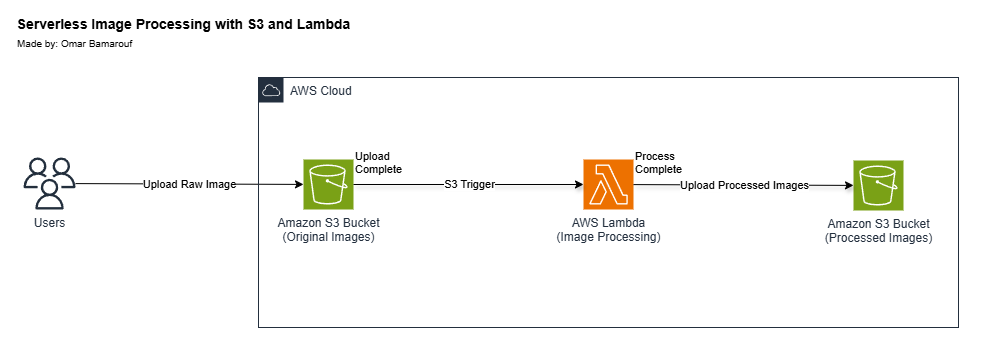

# Serverless Image Processing with S3 and Lambda
Final project for AWS Solutions Architect Course on Manara  
Solution made by student: Omar Bamarouf

## Table of Content
- [Project Overview](#project-overview)
- [Architecture Diagram](#architecture-diagram)
- [AWS Services Used](#aws-services-used)
- [Key Features](#key-features)

## Project Overview
This project presents a solution for serverless image processing where users can upload images to an S3 bucket, triggering an AWS Lambda function that resizes, applies watermark, and stores processed images in another S3 bucket.

## Architecture Diagram

## AWS Services Used
- **Amazon S3** – Stores original and processed images.
- **AWS Lambda** – Processes images (resize and apply watermarks).

## Key Features
- ✅ **Event-Driven Processing** – Automatically triggers Lambda on S3 uploads.
- ✅ **Image Transformations** – Resize and apply watermarks.
- ✅ **Cost-Efficient** – Pay-per-use with Lambda & S3.
- ✅ **Scalable** – Handles high traffic without manual scaling.
